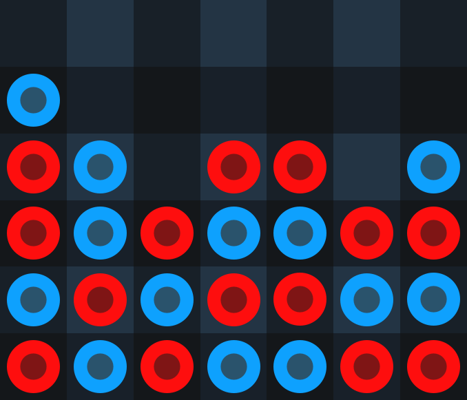

# Four in a Row
## Table of Contents
- [Introduction](#introduction)
- [License](#license)
## Introduction
Four in a Row is an open-source two-player turn-based game in which opponents attempt to play their chips until four of a player’s chips are adjacent or diagonal to each other. Whichever player's chips cause a game to end is the designated winner of said game.

[Four in a Row](https://www.urturn.app/games/62f0333fc4b031000ea00675) can be found on [Turn-Based Games' website](https://www.urturn.app).
## License
Four in a Row is licensed under the [MIT License](./LICENSE).